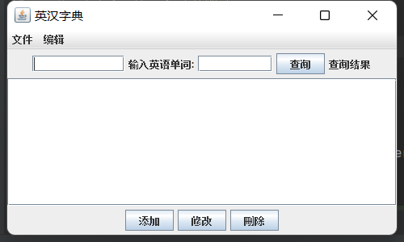
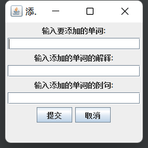

# 一个基于Java Swing 的GUI字典翻译应用

## 微信联系我 有偿修改 wx: bytecola

> 🚀 主要技术

- ✅ Java Swing GUI
- ✅ MySQL数据库

<br />


### 👉 启动

> 运行App的main方法即可

### 启动界面




## ✨ 代码结构

项目使用Flask blueprints, app factory pattern, 文件代码结构如下：

```bash
< PROJECT ROOT >
   |
   |-- src/
   |    |
   |    |-- Add                           # 增加字典词汇类
   |    |-- App                 # 应用运行的main方法主类
   |    |-- DataWindow                 # 数据窗体展现类
   |    |-- Delect                 # 删除字典词汇类
   |    |-- Modify                 # 修改字典词汇类

   |-- ************************************************************************
```

<br />

## 👉 联系我


